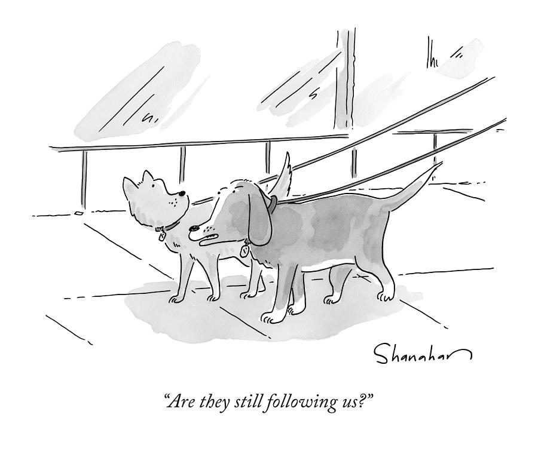
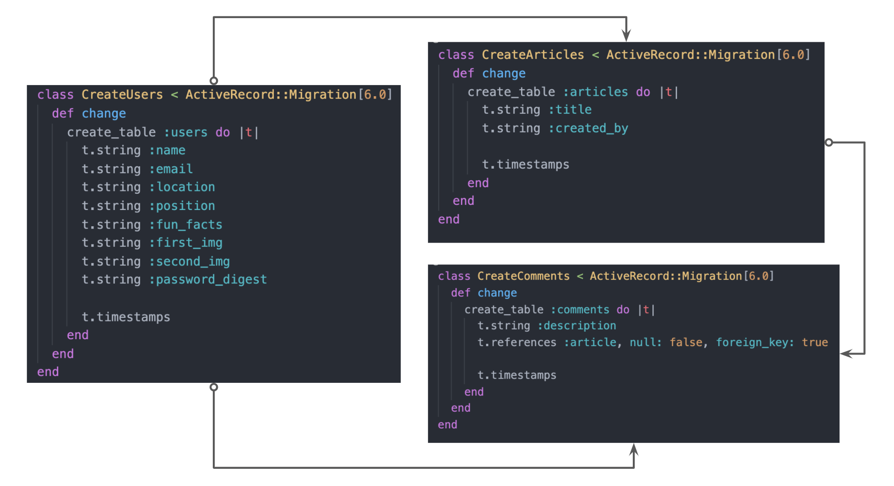

# Fire Hydrant 
### Employee Social Network 



<br>

## Overview

_Fire Hydrant is an internal organization web app that’s a hybrid between an employee directory and social network!_

### Design and Development

Designed by Simone Tobias and 
Michael LoPreto. Developed by Jeremy Taubman and Sinara Arliss.

### The Problem

It's difficult to stay connected with employees, on a personal and professional level, across a large organization with the majority of them working remote.

<br>

## MVP

_The minimum requirement for the fyre hydrant web app is to provide an online portal where users can register and login an account with name and password, then fill out their profile info. All users can post, edit and delete the projects they are working on. Also, all users get the ability to comment on posts._

- Use at least 1 API to call and display information.
- User profile content suggestions: location, timezone, weather, teams, projects, fun facts, etc.

<br>

### MVP Goals

- _You must be logged in to have access to all content in the DB (viewing permission)_
- _Users should have the ability to upload new post, edit and delete their own post, or comments in their post._
- _Users should have the ability to change user settings and credentials - job title, description, about me._
- _Users should be able to like and comment on their own post and/or other employees posts._

<br>

### MVP Libraries

|     Library      | Description                                                                       |
| :--------------: | :-------------------------------------------------------------------------------- |
|      React       | _Front end - renders HTML, CSS, adds functionality to the site and accesses the database._      |
|   React Router   | _Allows user to navigate through the website - auto directs when user is not logged in._ |
|  Ruby on Rails   | _Backend - database and auth (login/password - JWT)._                                                    |
| Ruby Controllers | _Create full CRUD endpoints (RESTful API)._                                       |

<br>

### MVP Client (Front End)

#### Wireframes

- Desktop Landing

- Login Page

- Register Page

- Posts Page

#### Component Hierarchy

```structure

src
|__ images/
|__ components/
      |__ Header.js
      |__ Logo.js
      |__ Footer.js
      |__ Main.js
      |__ Posts.js
      |__ Login.js
      |__ UserProfile.js
      |__ Register.js
      |__ UploadPost.js
      |__ UpdatePost.js
      |__ DeletePost.js
      |__ Comments.js
|__ services/
      |__ ApiHelper.js

```

<br>

### MVP Server (Back-End)

#### ERD Model



#### Data Heirarchy

```structure

database_db
|__ users/
|__ posts/
|__ comments/

```

<br>

## Goals & Challenges

_The goal is to have a 100% functioning full stack app that shows both our technical skills as a good eye for creativity and responsive design.

## Post-MVP - Stretch Goals

- _Password reset functionality_
  <br>
- _Followers_
  <br>
- _Upload image instead of image url_
  - Profile picture.
  - Project image.
  <br>
- _Chat Functionality_
  - Real time message to another users.
  <br>
- _Google maps integration with location_.

## Technology / Resources used

_Preparation_

- Figma
- VS Code
- Github
- Draw.io

_Backend_

- Ruby on Rails
- RESTful Api
- Postgres
- Heroku (deployment)

_Frontend_

- React
- React Router
- Axios
- Node.js
- Google Fonts
- AWS (deployment)

---

## Project Delivery

MPV: May 21, 2020.
Final presentation: May 22, 2020.


---